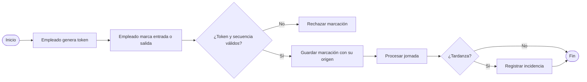

# pry-asistencia
# Plataforma Integrada para la Gestión y Control de Asistencia

Prototipo funcional de una plataforma web que centraliza el registro, procesamiento y consulta de la asistencia de los colaboradores de **Integrando Servicios S.A.C.**, con roles de Empleado, Supervisor y Administrador.

> Proyecto académico — Universidad Tecnológica del Perú, Ingeniería de Sistemas e Informática, 2026.
> *Integrando Servicios S.A.C. es una empresa ficticia construida con fines académicos.*

**Demo en línea:** https://lnaragio14.github.io/pry-asistencia/

---

## Tabla de contenidos

1. [Descripción](#1-descripción)
2. [Tecnologías](#2-tecnologías)
3. [Estructura del proyecto](#3-estructura-del-proyecto)
4. [Cómo ejecutar el proyecto](#4-cómo-ejecutar-el-proyecto)
5. [Usuarios de prueba](#5-usuarios-de-prueba)
6. [Pantallas por rol](#6-pantallas-por-rol)
7. [Arquitectura del frontend](#7-arquitectura-del-frontend)
8. [Reglas de negocio](#8-reglas-de-negocio)
9. [Modelo de datos](#9-modelo-de-datos)
10. [API de marcaciones (propuesta)](#10-api-de-marcaciones-propuesta)
11. [Guía de estilos](#11-guía-de-estilos)
12. [Cómo agregar una nueva pantalla](#12-cómo-agregar-una-nueva-pantalla)
13. [Limitaciones del prototipo](#13-limitaciones-del-prototipo)
14. [Autores](#14-autores)

---

## 1. Descripción

Actualmente, la información de asistencia de la empresa está dispersa entre un reloj biométrico, hojas de cálculo y aprobaciones por correo o papel, y se consolida manualmente. Esta plataforma permite:

- Registrar entradas y salidas con un **token temporal** de un solo uso.
- Procesar automáticamente la jornada: horas trabajadas, tardanzas y ausencias.
- Solicitar, aprobar y rechazar **horas extras** con trazabilidad.
- Gestionar empleados, horarios e **integraciones** con sistemas externos.
- Consultar indicadores y **exportar** la asistencia consolidada en CSV.

---

## 2. Tecnologías

| Capa | Prototipo actual | Arquitectura objetivo |
|---|---|---|
| Interfaz | HTML5, CSS3, JavaScript (ES6, sin frameworks) | HTML5, CSS3, JavaScript |
| Lógica de negocio | JavaScript en el navegador | Java (Spring Boot) |
| Persistencia | `sessionStorage` con datos simulados | MySQL 8 |
| Integraciones | Simulación de la API en la pantalla Integraciones | API REST en Java |

El prototipo no requiere instalación ni servidor de base de datos: los datos de prueba están en `js/datos.js`.

---

## 3. Estructura del proyecto

```
pry-asistencia/
├── index.html              # Login
├── README.md
├── css/
│   └── styles.css          # Estilos globales y paleta de colores
├── js/
│   ├── datos.js            # Datos simulados (equivalen a las tablas de la BD)
│   ├── app.js              # Núcleo compartido: sesión, permisos, menú y utilidades
│   ├── login.js
│   ├── dashboard.js
│   ├── marcar.js
│   ├── mi-asistencia.js
│   ├── horas-extras.js
│   ├── equipo.js
│   ├── aprobaciones.js
│   ├── empleados.js
│   ├── horarios.js
│   ├── integraciones.js
│   └── exportar.js
├── pages/
│   ├── dashboard.html
│   ├── marcar.html
│   ├── mi-asistencia.html
│   ├── horas-extras.html
│   ├── equipo.html
│   ├── aprobaciones.html
│   ├── empleados.html
│   ├── horarios.html
│   ├── integraciones.html
│   └── exportar.html
└── database/
    └── bd_gestion_asistencia.sql   # Script de creación de la BD (MySQL 8)
```

---

## 4. Cómo ejecutar el proyecto

### Opción A: en línea (sin instalar nada)

Abre la [demo en GitHub Pages](https://lnaragio14.github.io/pry-asistencia/).

### Opción B: en Visual Studio Code

1. Clona el repositorio:
   ```bash
   git clone https://github.com/lnaragio14/pry-asistencia.git
   ```
2. Abre la carpeta en VS Code e instala la extensión **Live Server**.
3. Clic derecho sobre `index.html` → **Open with Live Server**.

### Opción C: en GitHub Codespaces

```bash
python3 -m http.server 8000
```

Luego abre la pestaña **Puertos** y haz clic en el enlace del puerto `8000`.

> No abras `index.html` con doble clic (`file://`): algunos navegadores restringen `sessionStorage` en ese modo.

---

## 5. Usuarios de prueba

Todos usan la contraseña `123456`.

| Rol | Correo | Empleado asociado |
|---|---|---|
| Empleado | `empleado@empresa.com` | Juan Pérez (E001) |
| Supervisor | `supervisor@empresa.com` | María López (E002) |
| Administrador | `admin@empresa.com` | Carlos Ruiz (E003) |

Para reiniciar los datos de prueba, cierra la pestaña del navegador: `sessionStorage` se borra al cerrarla.

---

## 6. Pantallas por rol

| Pantalla | Archivo | Empleado | Supervisor | Administrador | Historia de usuario |
|---|---|:---:|:---:|:---:|---|
| Login | `index.html` | ✔ | ✔ | ✔ | RNF-01 |
| Dashboard | `pages/dashboard.html` | | ✔ | ✔ | HU-10 |
| Marcar asistencia | `pages/marcar.html` | ✔ | ✔ | | HU-03, HU-04, HU-05 |
| Mi asistencia | `pages/mi-asistencia.html` | ✔ | | | HU-06 |
| Horas extras | `pages/horas-extras.html` | ✔ | | | HU-08 |
| Asistencia del equipo | `pages/equipo.html` | | ✔ | | HU-07 |
| Aprobar horas extras | `pages/aprobaciones.html` | | ✔ | | HU-09 |
| Empleados | `pages/empleados.html` | | | ✔ | HU-01 |
| Horarios | `pages/horarios.html` | | | ✔ | HU-02 |
| Integraciones | `pages/integraciones.html` | | | ✔ | HU-11 |
| Exportar datos | `pages/exportar.html` | | | ✔ | HU-12 |

---

## 7. Arquitectura del frontend

### Orden de carga de scripts

Cada página interna carga tres scripts **en este orden**:

```html
<script src="../js/datos.js"></script>   <!-- 1. Datos -->
<script src="../js/app.js"></script>     <!-- 2. Sesión, permisos y utilidades -->
<script src="../js/pagina.js"></script>  <!-- 3. Lógica de la pantalla -->
```

### Responsabilidades de `app.js`

| Función / bloque | Qué hace |
|---|---|
| Verificación de sesión | Si no hay `usuarioActivo`, redirige al login |
| Control por rol | Compara el rol con el atributo `data-roles` del `<body>` |
| Menú dinámico | Construye el menú lateral según el rol (objeto `menus`) |
| `badgeEstado(estado)` | Devuelve la etiqueta de color de un estado de asistencia |
| `badgeSolicitud(estado)` | Etiqueta de color de una solicitud de horas extras |
| `procesarJornada(idEmpleado)` | Convierte las marcaciones del día en un registro de asistencia (RF-07) |
| `obtenerSolicitudes()` / `guardarSolicitudes()` | Leen y guardan las solicitudes compartidas |
| `guardarEmpleados()` / `guardarHorarios()` / `guardarOrigenes()` | Persisten los cambios del administrador |
| `aMinutos(hora)` / `mostrarAlerta(texto, tipo)` / `hoy` | Utilidades generales |

### Datos persistidos en `sessionStorage`

| Clave | Contenido | Escrita por |
|---|---|---|
| `usuarioActivo` | Usuario que inició sesión | `login.js` |
| `marcaciones` | Entradas y salidas registradas | `marcar.js`, `integraciones.js` |
| `solicitudes` | Solicitudes de horas extras | `horas-extras.js`, `aprobaciones.js` |
| `empleados` | Empleados modificados por el administrador | `empleados.js` |
| `horarios` | Horarios modificados por el administrador | `horarios.js` |
| `origenes` | Orígenes de marcación y credenciales | `integraciones.js` |

### Flujo de una marcación



---

## 8. Reglas de negocio

| Módulo | Regla |
|---|---|
| Token | Vigencia de 60 segundos y un solo uso |
| Marcación | Una entrada y una salida por día; no hay salida sin entrada previa |
| Marcación | Si el origen `PLATAFORMA` está desactivado, no se permite marcar desde la web |
| Tardanza | Se registra cuando la entrada supera la hora del horario más la tolerancia |
| Asistencia | Con entrada y sin salida, la jornada queda como `INCOMPLETA` |
| Horas extras | Máximo 4 horas por solicitud, sin fechas futuras, motivo de 10 caracteres como mínimo |
| Aprobación | Rechazar exige un comentario de 5 caracteres como mínimo; se guarda quién y cuándo decidió |
| Empleados | DNI de 8 dígitos y único; el administrador no puede desactivar su propia cuenta |
| Horarios | Salida mayor que la entrada; tolerancia entre 0 y 30 minutos; nombre único |
| Integraciones | Un origen externo solo se activa si tiene credenciales configuradas |
| Integraciones | Endpoints salientes solo con `https://`; API key de 16 caracteres como mínimo |

---

## 9. Modelo de datos

El script completo está en `database/bd_gestion_asistencia.sql` (MySQL 8.0.16 o superior).

| Tabla | Descripción | Arreglo en `datos.js` |
|---|---|---|
| `empleado` | Colaboradores; `id_supervisor` es una relación recursiva | `empleados` |
| `usuario` | Credenciales y rol (1:1 con empleado) | `usuarios` (en `login.js`) |
| `horario` | Jornadas y tolerancia | `horarios` |
| `origen_marcacion` | Fuente de la marcación y credenciales de integración | `origenesMarcacion` |
| `token_marcacion` | Autorización temporal para marcar | Variable `tokenActual` en `marcar.js` |
| `marcacion` | Entradas y salidas | `sessionStorage.marcaciones` |
| `asistencia` | Resultado diario de la jornada | `historialAsistencia`, `asistenciasHoy` |
| `incidencia` | Tardanzas y ausencias | Calculadas en `procesarJornada()` |
| `solicitud_hora_extra` | Solicitudes y su aprobación | `solicitudesHorasExtra` |

**Estados de asistencia:** `PRESENTE`, `TARDANZA`, `AUSENTE`, `INCOMPLETA`, `JUSTIFICADO`, `PERMISO`.

**Consideraciones de seguridad del diseño:**

- Contraseñas y API keys entrantes almacenadas como hash.
- Credenciales de integraciones salientes almacenadas cifradas.
- Claves foráneas con integridad referencial y `UNIQUE (id_empleado, fecha)` en asistencia.

---

## 10. API de marcaciones (propuesta)

Endpoint que usarán los sistemas externos (CRM, biométricos) para enviar marcaciones. En el prototipo se simula desde **Integraciones → Simular envío**.

```http
POST /api/v1/marcaciones
X-API-Key: ak_xxxxxxxxxxxxxxxxxxxxxxxxxxxxxxxx
Content-Type: application/json
```

```json
{
  "codigoEmpleado": "E001",
  "tipo": "ENTRADA",
  "fechaHora": "2026-09-29T08:02:00-05:00"
}
```

| Código | Significado |
|---|---|
| `201 Created` | Marcación registrada con su origen |
| `401 Unauthorized` | API key inválida |
| `403 Forbidden` | El origen está desactivado por el administrador |
| `409 Conflict` | Marcación duplicada o salida sin entrada previa |

---

## 11. Guía de estilos

Los colores están definidos como variables en `css/styles.css` (`:root`).

| Uso | Variable | Color |
|---|---|---|
| Azul principal / botones | `--azul` | `#2563EB` |
| Menú y encabezados | `--azul-oscuro` | `#1E3A5F` |
| Hover | `--azul-secundario` | `#3B82F6` |
| Fondo | `--fondo` | `#F8FAFC` |
| Texto principal | `--texto` | `#1F2937` |
| Texto secundario | `--texto-secundario` | `#6B7280` |
| Bordes | `--borde` | `#E5E7EB` |
| Presente | `--verde` | `#16A34A` |
| Tardanza | `--naranja` | `#F59E0B` |
| Falta | `--rojo` | `#DC2626` |
| Justificado | `--azul` | `#2563EB` |
| Permiso | `--morado` | `#7C3AED` |

**Componentes reutilizables:** `.btn` (`-primario`, `-exito`, `-eliminar`, `-advertencia`, `-secundario`, `-sm`), `.card`, `.badge-*`, `.alerta-*`, `.tabla`, `.modal-fondo`, `.form-grupo`, `.grid-indicadores`.

---

## 12. Cómo agregar una nueva pantalla

1. Copia `pages/dashboard.html` como plantilla y cambia el título y el contenido de `<main>`.
2. Define qué roles pueden verla en el `<body>`:
   ```html
   <body data-roles="SUPERVISOR,ADMINISTRADOR">
   ```
3. Crea su script en `js/` y cárgalo **después** de `datos.js` y `app.js`.
4. Agrega la opción al objeto `menus` en `js/app.js`:
   ```javascript
   { texto: "Nueva pantalla", url: "nueva-pantalla.html" }
   ```

---

## 13. Limitaciones del prototipo

- Los datos son simulados y se borran al cerrar la pestaña.
- Las contraseñas y API keys se manejan en texto plano en el navegador (solo para la simulación).
- Los empleados creados por el administrador no tienen cuenta de acceso.
- No se contemplan horarios nocturnos que crucen la medianoche.
- La prueba de conexión de integraciones es simulada.

---

## 14. Autores

| Integrante | Código |
|---|---|
| Barragan Quispe, Juan Alonso | U21313719 |
| Flores Arauco, Hector Manuel | U23101430 |
| Lumba Apagüeño, Jose Carlos | U24221283 |
| Naragio Chavez, Leyla Viviana | U24219412 |